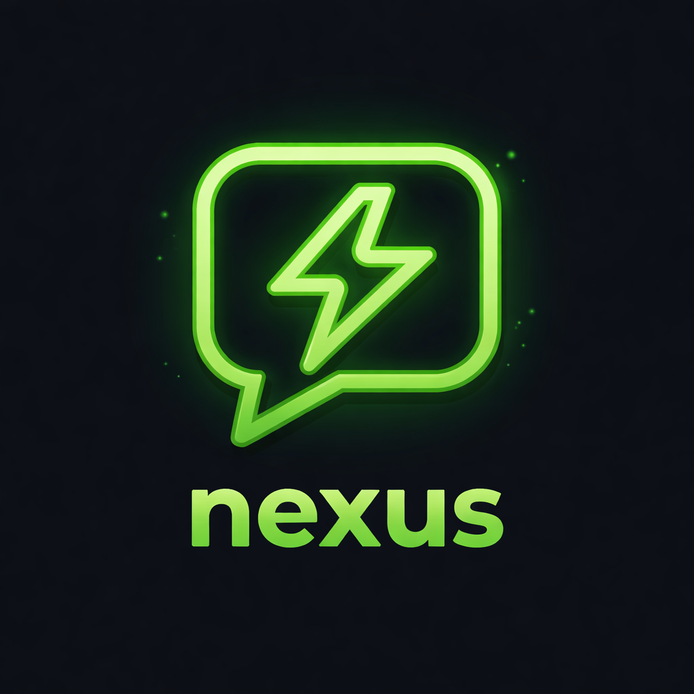

<p align="center">
  
</p>

<h1 align="center">Nexus</h1>

<p align="center">
  An open-source AI agent workspace with sandboxed code execution, knowledge bases, and multi-model support.
</p>

<p align="center">
  <a href="#features">Features</a> •
  <a href="#tech-stack">Tech Stack</a> •
  <a href="#getting-started">Getting Started</a> •
  <a href="#deployment">Deployment</a> •
  <a href="#license">License</a>
</p>

---

## Features

### Multi-Model Chat

Connect to any LLM provider through a [LiteLLM](https://github.com/BerriAI/litellm) proxy — Claude, GPT-4, Llama, DeepSeek, Grok, and more. Switch models mid-conversation, generate multiple responses in parallel, and branch conversation history to explore different directions.

### Sandboxed Code Execution

Run Python, JavaScript, TypeScript, and Bash in isolated [Daytona](https://github.com/daytonaio/daytona) sandboxes. Read and write files, preview running applications, and stream output in real time — all without risking your host environment.

### Custom Agents

Build reusable AI agents with custom system prompts, tool configurations, and personas. Share agents publicly through a built-in marketplace, schedule automated runs on a cron, and track execution history.

### Knowledge Bases & RAG

Upload documents, chunk and embed them with pgvector, and retrieve relevant context at query time with Cohere reranking. Attach knowledge bases to conversations for grounded, citation-backed answers.

### Built-in Tools

| Category | Tools |
|---|---|
| **Code** | Execute code, file read/write/list |
| **Web** | Browse pages, REST API calls (GET/POST/PUT/DELETE/PATCH) |
| **Search** | Google, News, Scholar, YouTube, Maps, Bing, DuckDuckGo |
| **Data** | SQL queries on CSV/Excel/Parquet via DuckDB |
| **Visualization** | Interactive Vega-Lite charts |
| **Media** | Image generation, video generation, text-to-speech |
| **Forms** | Dynamic form creation with validation |

### Workspace Organization

Multi-org support with WorkOS SSO, project-based organization, user roles and RBAC, audit logging, and conversation pinning. An artifact center tracks generated files, diffs, and terminal output in a unified workspace panel.

## Tech Stack

| Layer | Technology |
|---|---|
| **Backend** | FastAPI, SQLAlchemy (async), PostgreSQL, pgvector, Redis, Alembic |
| **Frontend** | Next.js 15, React 19, TypeScript (strict), Zustand, TailwindCSS |
| **Code Execution** | Daytona sandboxed environments |
| **Auth** | WorkOS (password + SSO), JWT sessions, CSRF protection |
| **AI Gateway** | LiteLLM proxy (route to any LLM provider) |
| **Observability** | OpenTelemetry, Prometheus metrics |
| **Task Runner** | [just](https://github.com/casey/just) |

## Getting Started

### Prerequisites

- Python 3.12+ (managed with [uv](https://github.com/astral-sh/uv))
- Node.js 20+
- PostgreSQL 15+ with pgvector
- Redis
- [just](https://github.com/casey/just)

### Setup

```bash
# Clone the repo
git clone https://github.com/BBQuercus/nexus.git
cd nexus

# Install backend and frontend dependencies
just install

# Copy the example env and fill in your values
cp .env.example .env

# Start PostgreSQL, Redis, run migrations, and launch both servers
just dev
```

The backend runs at `http://localhost:8000` and the frontend at `http://localhost:5173`.

### Configuration

Copy `.env.example` and configure the required services:

| Variable | Description |
|---|---|
| `DATABASE_URL` | PostgreSQL connection string |
| `REDIS_URL` | Redis connection string |
| `SERVER_SECRET` | Secret key for JWT signing |
| `LITE_LLM_URL` | LiteLLM proxy URL |
| `LITE_LLM_API_KEY` | LiteLLM API key |
| `WORKOS_API_KEY` | WorkOS API key for authentication |
| `WORKOS_CLIENT_ID` | WorkOS client ID |
| `DAYTONA_API_KEY` | Daytona API key for sandboxed execution |
| `DAYTONA_SERVER_URL` | Daytona server URL |

Optional integrations: Cohere (reranking), SerpAPI (web search), Azure Speech (TTS), Sora (image/video generation).

### Common Commands

```bash
just dev            # Start everything locally
just test           # Run all tests
just lint           # Lint backend (Ruff) + frontend (ESLint)
just type-check     # MyPy + tsc
just migrate        # Run Alembic migrations
just ci             # Full CI pipeline
```

## Deployment

Nexus is designed for [Railway](https://railway.app) with separate backend and frontend services, but can be deployed anywhere that runs Docker containers.

```
┌─────────────┐     ┌──────────────┐
│  Frontend   │────▶│   Backend    │
│  (Next.js)  │     │  (FastAPI)   │
└─────────────┘     └──────┬───────┘
                           │
                    ┌──────┴───────┐
                    │              │
               ┌────▼────┐  ┌─────▼────┐
               │PostgreSQL│  │  Redis   │
               │+pgvector │  │          │
               └──────────┘  └──────────┘
```

Railway manifests are in `railway/backend.toml` and `railway/frontend.toml`. CI/CD workflows handle automatic deployments on push.

## Contributing

Contributions are welcome! Please open an issue or submit a pull request.

```bash
# Before committing, make sure everything passes
just ci
```

## License

[Apache 2.0](LICENSE) — see the [LICENSE](LICENSE) file for details.
